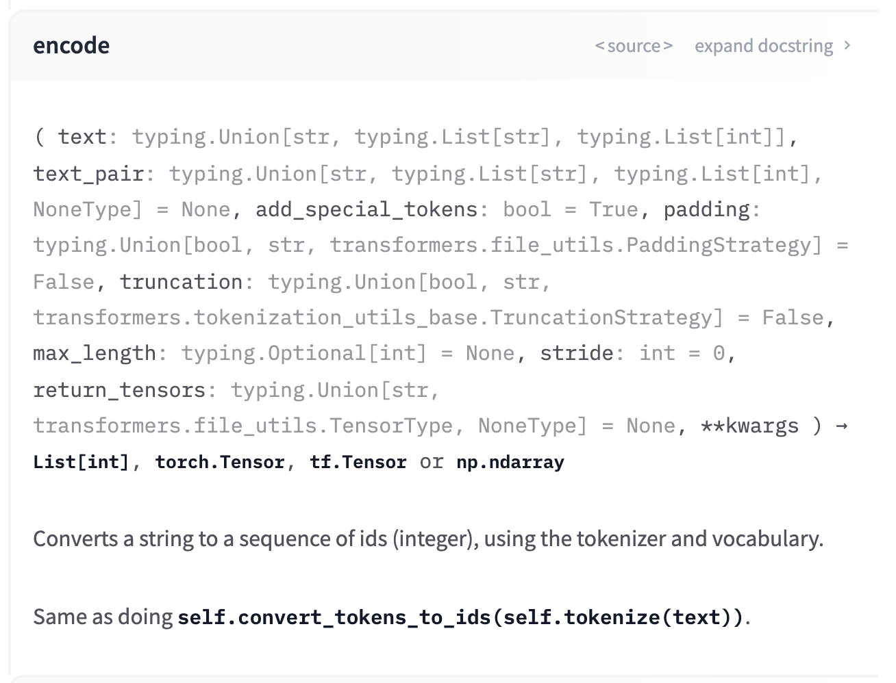

## Tokenizer


tokenizer 사용시 고려하면 좋을 몇가지 포인트


#### 01 tokenizer.encode 와 tokenizer.convert_tokens_to_ids

transformers document를 확인해보면 tokenizer.encode와 tokenizer.convert_tokens_to_ids 가 동일한 역할을 수행한다고 적혀있다. 하지만 그렇지 않은 경우가 있음을 알게되어 간략히 정리하고자 한다.



현재 실험중인 데이터의 특정단어는 복합어로 이루어진 경우가 많다. 차이점을 찾게된 예제는 'allenbell' 라는 단어이다.

```python
from transformers import AutoTokenizer

bert = 'bert-base-uncased'
tokenizer = AutoTokenizer.from_pretrained(bert)

print(tokenizer.encode('allenbell',add_special_tokens=False))
print(tokenizer.convert_tokens_to_ids('allenbell'))
```

위의 코드를 실행하면  두가지 값은 다르게 산출된다. 

~~~py
[5297, 17327] #tokenizer.encode 결과물
100 #tokenizer.convert_tokens_to_ids 결과물
~~~

encode를 수행하면 복합어를 tokenization을 수행한 후 convert_tokens_to_ids를 수행하지만

**convert_tokens_to_ids는 tokenization을 수행하지 않고 다이렉트로 token이 vocab에 존재하지 않는지 체크한 후 id를 반환한다.** 이 과정에서 allenbell 이라는 복합어는 dictionary 내부에 존재하지 않으므로 [UNK] 토큰이 되어버린다

궁금해서 소스코드를 읽어보다가 원인을 알게되었는데, convert_tokens_to_ids 내부에는 **Isinstance함수로 인풋값이 str인지 체크한 다음, str일 경우 바로 token을 vocab에서 찾아 id와 mapping한다.** encode는 내부에서 convert_tokens_to_ids를 수행하지만 tokenization 결과값 list 가 생성된 다음 해당 메서드를 진행하므로 [UNK] 토큰이 아닌 아웃풋을 얻을 수 있다.

소중한 단어를 [UNK]로 날려먹지 않으려면 안전하게 encode를 사용해야겠다는 교훈을 얻었다 🥲

